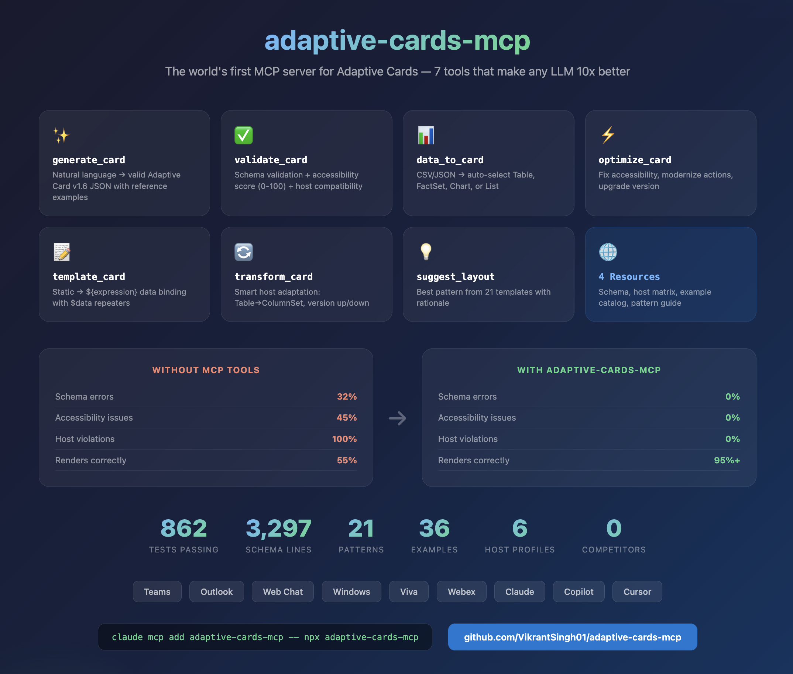
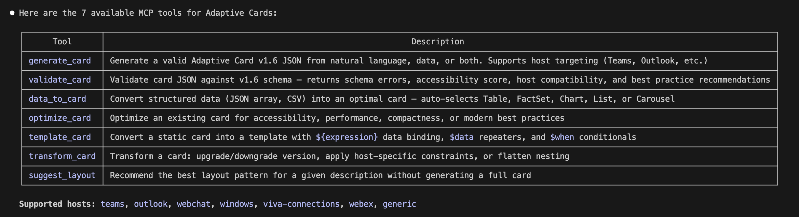

# Adaptive Cards MCP

[](https://opensource.org/licenses/MIT)
[](https://www.typescriptlang.org/)
[](https://adaptivecards.io/)
[]()
[](https://www.npmjs.com/package/adaptive-cards-mcp)
[](https://github.com/VikrantSingh01/adaptive-cards-mcp/releases/tag/v2.1.0)

<p align="center">
  
</p>

The world's first MCP server for Adaptive Cards — **9 tools** that make any LLM 10x better at card generation. An MCP server that helps AI assistants generate valid, accessible Adaptive Cards for Teams, Outlook, Copilot, and other agentic surfaces.

> **Blog:** [I Built an MCP Server That Makes AI 10x Better at Adaptive Cards](https://singhvikrant.substack.com/p/i-built-an-mcp-server-that-makes)

Available as an **MCP server** (stdio + HTTP/SSE), **npm library**, and **VS Code extension**.

## What's New in v2.1.0

- **HTTP/SSE Transport** — Deploy for M365 Copilot, Copilot Studio, and ChatGPT (`TRANSPORT=sse`)
- **Card Persistence** — `cardId` references across tool calls to reduce token overhead
- **Compound Tools** — `generate_and_validate` and `card_workflow` for multi-step pipelines
- **MCP Prompts** — 3 guided prompts for common workflows
- **Auth Middleware** — API key + bearer token for HTTP deployments
- **Azure OpenAI + Ollama** — Additional LLM provider support
- **Input Guards, Rate Limiting, Telemetry** — Enterprise hardening

See the full [CHANGELOG](CHANGELOG.md) for details.

## Ecosystem

| Package | Description | Install |
|---------|-------------|---------|
| [packages/core](packages/core/) | MCP server + npm library (9 tools) — [npm](https://www.npmjs.com/package/adaptive-cards-mcp) | `npx adaptive-cards-mcp` |
| [packages/vscode-extension](packages/vscode-extension/) | VS Code extension — generate, preview, validate | [adaptive-cards-ai-vscode](https://github.com/VikrantSingh01/adaptive-cards-ai-vscode) |

## Quick Start

### MCP Server Setup

**Claude Code:**
```bash
claude mcp add adaptive-cards-mcp -- npx adaptive-cards-mcp
```

**GitHub Copilot (VS Code):** Add to `.vscode/mcp.json`:
```json
{
  "servers": {
    "adaptive-cards-mcp": {
      "command": "npx",
      "args": ["adaptive-cards-mcp"]
    }
  }
}
```

**Cursor:** Add to `.cursor/mcp.json`:
```json
{
  "mcpServers": {
    "adaptive-cards-mcp": {
      "command": "npx",
      "args": ["adaptive-cards-mcp"]
    }
  }
}
```

**Windsurf:** Add to `~/.codeium/windsurf/mcp_config.json`:
```json
{
  "mcpServers": {
    "adaptive-cards-mcp": {
      "command": "npx",
      "args": ["adaptive-cards-mcp"]
    }
  }
}
```

**Microsoft 365 Copilot / Copilot Studio (HTTP/SSE):**
```bash
# Start the HTTP/SSE server
TRANSPORT=sse PORT=3001 npx adaptive-cards-mcp

# With auth enabled
TRANSPORT=sse MCP_API_KEY=your-secret npx adaptive-cards-mcp
```
1. Open [Copilot Studio](https://copilotstudio.microsoft.com/) → your agent → Tools → Add a tool → New tool → **Model Context Protocol**
2. Enter your MCP server URL (e.g., `https://your-server.azurewebsites.net/sse`)
3. Select the tools to expose

**OpenAI ChatGPT:**
1. Enable [Developer mode](https://help.openai.com/en/articles/12584461-developer-mode-apps-and-full-mcp-connectors-in-chatgpt-beta) in ChatGPT settings
2. Go to Settings → Connectors → Create
3. Enter your MCP server HTTPS URL

**Any MCP client (stdio):**
```bash
npx adaptive-cards-mcp
```

Then ask your AI assistant:
- *"Generate an expense approval card for Teams"*
- *"Convert this JSON data to an Adaptive Card table"*
- *"Validate this card and check accessibility"*

## Demo

**9 MCP tools available in any AI assistant:**

<p align="center">
  
</p>

**Live card generation — natural language to valid Adaptive Card JSON:**

<p align="center">
  
</p>

### npm Library

```typescript
import { generateCard, validateCardFull, dataToCard, optimizeCard } from 'adaptive-cards-mcp';

const result = await generateCard({
  content: "Create a flight status card",
  host: "teams",
  intent: "display"
});

console.log(result.card);       // Adaptive Card JSON
console.log(result.cardId);     // Reference ID for subsequent calls
console.log(result.validation); // Schema + accessibility + host compat
```

## MCP Tools (9)

| Tool | Description |
|------|-------------|
| `generate_card` | Natural language / data → valid Adaptive Card v1.6 JSON |
| `validate_card` | Schema validation + accessibility score + host compatibility + **suggested fixes** |
| `data_to_card` | Auto-select Table / FactSet / Chart / List from data shape |
| `optimize_card` | Improve accessibility, performance, modernize actions |
| `template_card` | Static card → `${expression}` data-bound template |
| `transform_card` | Version upgrade/downgrade, host-config adaptation |
| `suggest_layout` | Recommend best layout pattern for a description |
| `generate_and_validate` | **New** — Generate + validate + optionally optimize in one call |
| `card_workflow` | **New** — Multi-step pipeline: generate → optimize → template → transform |

### MCP Prompts (3)

| Prompt | Description |
|--------|-------------|
| `create-adaptive-card` | Guided card creation with host/intent parameters |
| `review-adaptive-card` | Accessibility and compatibility review workflow |
| `convert-data-to-card` | Data transformation with presentation selection |

### MCP Resources (5) + Templates (2)

| Resource | Description |
|----------|-------------|
| `ac://schema/v1.6` | Complete JSON Schema for Adaptive Cards v1.6 |
| `ac://hosts` | Host compatibility matrix for all 7 hosts |
| `ac://hosts/{hostName}` | **Template** — Single host compatibility info |
| `ac://examples` | 36 curated example cards catalog |
| `ac://examples/{intent}` | **Template** — Examples filtered by intent |
| `ac://patterns` | 11 canonical layout patterns |
| `ac://cards` | Session card store (cards by cardId) |

## Configuration

| Environment Variable | Description | Default |
|---------------------|-------------|---------|
| `TRANSPORT` | Transport mode: `stdio` or `sse` | `stdio` |
| `PORT` | HTTP port for SSE transport | `3001` |
| `MCP_API_KEY` | API key for HTTP auth | *(disabled)* |
| `MCP_AUTH_MODE` | Auth mode: `bearer` for token validation | *(disabled)* |
| `ANTHROPIC_API_KEY` | Anthropic Claude API key | *(deterministic mode)* |
| `OPENAI_API_KEY` | OpenAI API key | *(deterministic mode)* |
| `AZURE_OPENAI_API_KEY` | Azure OpenAI API key | *(disabled)* |
| `AZURE_OPENAI_ENDPOINT` | Azure OpenAI endpoint URL | *(disabled)* |
| `OLLAMA_BASE_URL` | Ollama local model URL | *(disabled)* |
| `DEBUG` | Enable debug logging: `adaptive-cards-mcp` | *(disabled)* |
| `MCP_RATE_LIMIT` | Enable rate limiting: `true` | `false` |
| `MCP_TELEMETRY` | Enable metrics collection: `true` | `false` |

## Host Compatibility

| Host | Max Version | Notes |
|------|-------------|-------|
| Teams | 1.6 | Max 6 actions, Action.Execute preferred |
| Outlook | 1.4 | Limited elements, max 4 actions |
| Web Chat | 1.6 | Full support |
| Windows | 1.6 | Subset of elements |
| Viva Connections | 1.4 | SPFx-based ACE framework |
| Webex | 1.3 | No Table, no Action.Execute |

## Development

```bash
cd packages/core
npm install
npm run build         # TypeScript + copy data files
npm test              # 909 tests (vitest)
npm run test:coverage # With coverage report
npm run lint          # TypeScript type check
npm run lint:eslint   # ESLint check
npm run format        # Prettier formatting
```

## Architecture

```
packages/core/src/
├── server.ts              # MCP server (stdio + SSE, 9 tools, 3 prompts)
├── index.ts               # Library exports
├── types/                 # TypeScript interfaces
├── core/                  # Schema validator, analyzer, accessibility, host compat
├── generation/            # 11 layout patterns, data analyzer, assembler, LLM client
├── tools/                 # 9 tool handlers
├── utils/                 # Logger, input guards, rate limiter, card store, auth, telemetry
└── data/                  # v1.6 schema, 36 examples, host configs
```

## Related Projects

- [AdaptiveCards-Mobile](https://github.com/nicfera/AdaptiveCards-Mobile) — Cross-platform Adaptive Cards renderer
- [Adaptive Cards Documentation](https://adaptivecards.microsoft.com/) — Official docs
- [Adaptive Cards Designer](https://adaptivecards.microsoft.com/designer) — Interactive card designer
- [openclaw-adaptive-cards](https://github.com/VikrantSingh01/openclaw-adaptive-cards) — OpenClaw AI agent plugin that uses this library as its core engine for card validation, host adaptation, and accessibility checking
- [Adaptive Cards Schema Explorer](https://adaptivecards.io/explorer/) — Interactive schema reference

## License

MIT
